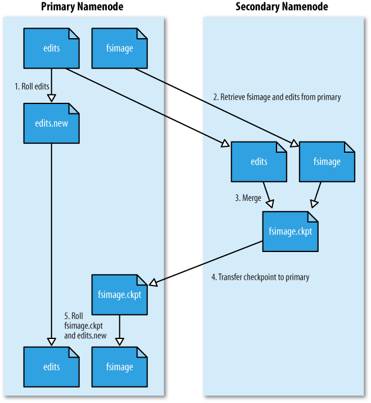

# 세컨더리 네임노드

네임노드가 구동되고 나면 Edits 파일이 주기적으로 생성됨. 네임노드의 트랜잭션이 빈번하면 빠른 속도로 Edits 파일이 생성됨. 이는 네임노드의 디스크 부족 문제를 생성할 수도 있고, 네임노드가 재구동 되는 시간을 느려지게 할 수도 있음.

세컨더리 네임노드는 Fsimage와 Edits 파일을 주기적으로 머지하여 최신 블록의 상태로 파일을 생성함. 파일을 머지하면서 Edits 파일을 삭제하기 때문에 디스크 부족 문제도 해결할 수 있음.

