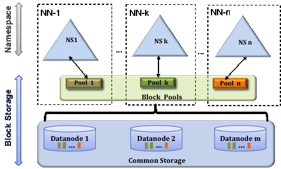

# HDFS

## 01. 구조
---
[01.구조](hdfs-01-구조.md)

[01.1.블록](hdfs-01.1-블록.md)

[01.2.세컨더리_네임노드](hdfs-01.2-세컨더리_네임노드.md)

## 02. HDFS Federation
---
네임노드는 파일 정보 메타데이터를 메모리에서 관리함. 파일이 많아지면 메모리 사용량이 늘어나게 되고, 메모리 관리가 문제가 됨. 이를 해결하기 위해 하둡 v2부터 HDFS 페더레이션을 지원함.

HDFS 페더레이션은 디렉토리(namespace) 단위로 네임노드를 등록하여 사용하는 것임. 예를 들어 user, hadoop, tmp 세개의 디렉토리가 존재할 때, /user, /hadoop, /tmp 디렉토리 단위로 총 3개의 네임노드를 실행하여 파일을 관리하게 하는 것임.

HDFS 페더레이션을 사용하면 파일, 디렉토리의 정보를 가지는 네임스페이스와 블록의 정보를 가지는 블록 풀을 각 네임노드가 독립적으로 관리함. 네임스페이스와 블록풀을 네임스페이스 볼륨이라하고 네임스페이스 볼륨은 독립적으로 관리되기 때문에 하나의 네임노드에 문제가 생겨도 다른 네임노드에 영향을 주지 않음.



## 03. HDFS High Availability
---
HDFS는 namenode 가 single point of failure(SPOF)임. 네임노드에 문제가 발생하면 모든 작업이 중지되고, 파일을 읽거나 쓸 수 없게 됨. 하둡 v2 에서 이 문제를 해결하기 위해서 HDFS High Availability 를 제공함.

HDFS High Availability는 이중화된 두대의 서버인 active 네임노드와 standby 네임노드를 이용하여 지원함. 액티브 네임노드와 스탠바이 네임노드는 데이터 노드로부터 블록 리포트와 하트비트를 모두 받아서 동일한 메타데이터를 유지하고, 공유 스토리지를 이용하여 에디트 파일을 공유함.

액티브 네임노드는 네임노드의 역할을 수행하고, 스탠바이 네임노드는 액티브 네임노드와 동일한 메타데이터 정보를 유지하다가, 액티브 네임노드에 문제가 발생하면 스탠바이 네임노드가 액티브 네임노드로 동작하게 됨. 액티브 네임노드에 문제가 발생하는 것을 자동으로 확인하기 어렵기 때문에 보통 주키퍼를 이용하여 장애 발생 시 자동으로 변경될 수 있도록 함.

스탠바이 네임노드는 세컨더리 네임노드의 역할을 동일하게 수행함. 따라서 HDFS를 High Availability 모드로 설정하였을 때는 세컨더리 네임노드를 실행하지 않아도 됨. 고가용성 모드에서 세컨더리 네임노드를 실행하면 오류가 발생함.

### 03.1 QJM (Quorum Journal Manager)

QJM은 HDFS 전용 구현체로, High Availability 에디트 로그를 지원하기 위한 목적으로 설계되었고 HDFS의 권장 옵션임. QJM은 저널 노드 그룹에서 동작하며, 각 에디트 로그는 전체 저널 노드에 동시에 쓰여짐. 일반적으로 저널 노드는 세 개로 구성하며, 그중 하나가 손상되어도 문제가 없는 시스템임. 이러한 방식은 주키퍼의 작동 방식과 매우 유사하지만 QJM은 주키퍼를 사용하지 않고도 이런 기능을 구현했다는 점이 중요함. 물론 HDFS High Availability 모드는 액티브 네임노드를 선출하기 위해 주키퍼를 이용함.

스탠바이 네임노드를 활성화시키는 전환 작업은 장애복구 컨트롤러(failover controller)라는 새로운 객체로 관리됨. 다양한 방법으로 failover controller를 구현할 수 있지만, 기본 설정은 단하나의 네임노드만 활성 상태에 있다는 것을 보장하기 위해 주키퍼를 이용함.

### 03.2 NFS (Network File System)


에디트 파일을 공유 스토리지 (NFS)를 이용하여 공유하는 방법. 공유 스토리지에 에디트 로그를 공유하고 펜싱을 이용하여 하나의 네임노드만 에디트 로그를 기록하도록 함.

## 04. HDFS Safemode
---
HDFS 의 safemode는 데이터 노드를 수정할 수 없는 상태임. safemode 가 되면 데이터는 읽기 전용 상태가 되고, 데이터 추가와 수정이 불가능하며 데이터 복제도 일어나지 않음. 관리자가 서버 운영 정비를 위해 세이프 모드를 설정 할 수도 있고, 네임노드에 무넺가 생겨서 정상적인 동작을 할 수 없을 때 자동으로 safemode로 전환됨.

safemode 에서 파일 수정은 다음과 같이 오류를 출력함.

```bash
$ hadoop fs -put ./sample.txt /user/sample.txt
put: Cannot create file/user/sample2.txt._COPYING_. Name node is in safe mode.
```

### 04.1. Commands for safemode
세이프 모드 상태의 확인, 진입, 해제 커맨드는 다음과 같음.

```bash
# 세이프 모드 상태 확인 
$ hdfs dfsadmin -safemode get
Safe mode is OFF

# 세이프 모드 진입 
$ hdfs dfsadmin -safemode enter
Safe mode is ON

# 세이프 모드 해제 
$ hdfs dfsadmin -safemode leave
Safe mode is OFF
```

### 04.2. safemode 의 복구
HDFS 운영 중 네임노드 서버에 문제가 생겨서 세이프 모드에 진입하는 경우는 네임노드 자체의 문제와 데이터 노드의 문제일 경우가 많음.

 `fsck`명령으로 hdfs 의 무결성을 체크하고, `hdfs dfsadmin -report` 명령으로 각 데이터 노드의 상태를 확인하여 문제를 확인하고 해결한 수 세이프 모드를 해제하면 됨.

## 05. HDFS 데이터 블록 관리 
---
[05. HDFS 데이터 블록 관리](hdfs-05-데이터블록_관리.md)

## 06. HDFS 휴지통
---
HDFS는 사용자의 실수에 의한 파일 삭제를 방지하기 위해서 휴지통 기능을 제공함.

휴지통 기능이 설정되면 HDFS에서 삭제한 파일은 바로 삭제되지 않고, 각 사용자이ㅡ 홈디렉토리 아래 휴지통 디렉토리(/user/유저명/.Trash)로 이동됨.

휴지통 디렉토리는 지정한 간격으로 체크포인트가 생성되고, 유효 기간이 만료되면 체크포인트를 삭제함. 삭제되면 해당 블록을 해제하고, 사용자에게 반환함.

### 06.1. 휴지통 설정

| 설정값 | 비고 |
|---|---|
|`fs.trash.interval`|체크포인트를 삭제하는 시간 간격(분). 0이면 휴지통 기능을 끔.|
|`fs.trash.checkpoint.interval`|체크포인트를 확인하는 간격(분). fs.trash.interval과 같거나 작아야 함. 체크포인트를 생성하고, 유효기간이 지난 체크포인트는 삭제.|

core-site.xml 에 아래와 같이 설정함.

```xml
<property>
    <name>fs.trash.interval</name>
    <value>1440</value>
</property>
<property>
    <name>fs.trash.checkpoint.interval</name>
    <value>120</value>
</property>
```

### 06.2. 휴지통 명령

```bash
# 휴지통을 비움. 
$ hadoop fs -expunge

# 휴지통을 이용하지 않고 삭제 
$ hadoop fs -rm -skipTrash /user/data/file
```

## 07. HDFS Commands
---
[07.HDFS Commands](hdfs-07-명령어.md)

## 08. WebHDFS REST API 사용법
