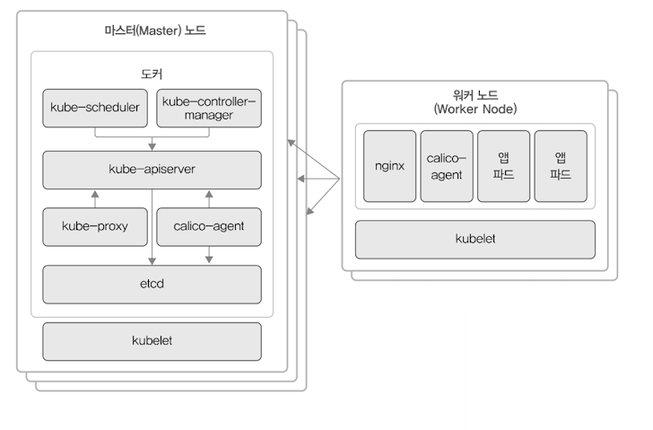

## 2.4.2 Kubespray

[Kubespray](https://kubespray.io)는 상용 서비스에 적합한 보안성과 고가용성(High-availability)이 있는 쿠버네티스 클러스터를 배포하는 오픈 소스 프로젝트임. 처음에는 kargo 라는 이름으로 시작, Kubespray 로 프로젝트 이름이 변경되.

kubespray 는 앤서블 기반으로 개발함.

CNI(Container Network Interface)는 칼리코(calico)를 기본 플러그인으로 사용함.

|플러그인 이름| 설명|
|-|-|
|칼리코(calico)|BGP(layer 3) 기반 네트워킹을 지원하고, IPinIP 터널링 기능을 옵션으로 사용할 수 있음. 티제라(Tigera)라는 회사의 주도로 개발하고 있으며 아마존 웹서비스, 구글 클라우드 플랫폼 등 관리형 쿠버네티스 서비스를 제공하는 회사 대부분에서 칼리코를 기본 네트워크 플러그인으로 사용함. Kubespray의 기본 설정이기도 함. 클러스터 당 최대 5,000개 노드까지 사용할 수 있으며 클러스터 규모가 크다면 성능과 안정성을 보장하도록 라우팅 정보 공유를 매개하는 라우트 리플렉터 노드(Route Reflector Node)를 둘 것으로 권장함. 온프레미스 환경에서 네이티브 라우팅을 지원하는 좋은 옵션으로 고려할 수 있음.

쿠버네티스 클러스터 구성은 마스터노드(3대), 워커노드(2대)로 하겠음. 노드 각각의 역할은 다음과 같음.

* 마스터 노드(Master Node): 노드들의 상태를 관리하고 제어함. 쿠버네티스의 데이터 저장소로 사용하는 etcd를 함께 설치하거나 별도 노드에 분리해서 설치하기도 함. 이 실습에서는 함께 설치하겠음. 마스터 노드를 1대만 설치할 수도 있지만 상용 서비스라면 보통 고가용성을 고려해 3대나 5대로 구성함. 홀수로 구성한다면 7대 이상도 가능하지만 kube-controller-manager 가 활성화 상태로 동작할 수 있는 리더 마스터 노드는 1대임. 마스터 노드가 많다고 해서 성능이 크게 향상되지는 않으므로 3~5대가 적당.
* 워커 노드(Worker Node): kubelet이라는 프로세스(에이전트)가 동작하며, 마스터 노드의 명령을 받아 사용자가 선언한 pod나 job을 실제 실행함.

