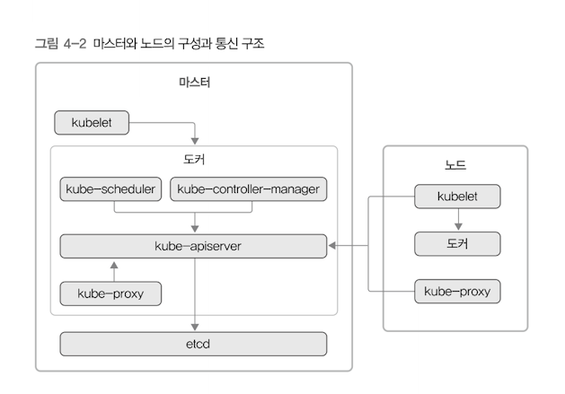
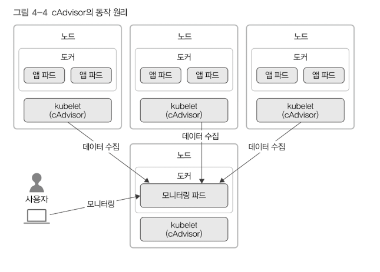

# 4 쿠버네티스 아키텍처

## 4.1 쿠버네티스 클러스터의 전체 구조

쿠버네티스 클러스터는 크게 두 종류의 서버로 구성함. 클러스터를 관리하는 master와 실제 컨테이너를 실행시키는 node 임.

마스터에는 etcd, kube-apiserver, kube-scheduler, kube-controller-manager, kubelet, kube-proxy, docker 등의 컴포넌트가 실행됨. 컴포넌트 각각이 다른 마스터나 노드 서버에 별개로 실행되어도 실제 쿠버네티스 클러스터를 운영하는 데 이상은 없음. 하지만 마스터가 서버 1대라면 방금 소개한 프로세스 한 묶음을 해당 서버에서 같이 실행하는 것이 일반적인 구성임.

마스터는 보통 high-availablity를 만족하고자 서버 3대 정도 구성해서 운영함. 평소 실제 클러스터를 관리하는 리더 마스터는 1대고 나머지 2대는 대기함. 리더 마스터가 장애가 발생하면 자연스럽게 나머지 2대 중 1대가 리더 역할을 맡음. 클러스터를 좀 더 안정적으로 운영하려면 마스터를 서버 5대로 구성할 수도 있음.

노드에는 kubelet, kube-proxy, docker 등의 컴포넌트가 실행됨. 실제 사용하는 컨테이너 대부분은 노드에서 실행됨. 



각 컴포넌트의 중심에 kube-apiserver 가 있음. 쿠버네티스의 모든 통신은 kube-apiserver가 중심임. kube-apiserver를 거쳐 다른 컴포넌트가 서로 필요한 정보를 주고 받음. 특히 etcd 에는 kube-apiserver만 접근할 수 있음.

마스터를 보면 kubelet 이 마스터에 있는 도커를 관리함. 도커 안에는 앞에서 소개한 쿠버네티스 관리용 컴포넌트 kube-scheduler, kube-controller-manager, kube-apiserver, kube-proxy 가 있음. 
etcd 는 컨테이너가 아니라 별도의 프로세스로 설정되어 있음. 사실 etcd까지 컨테이너로 설정할 수 있지만 컨테이너가 아닌 서버 프로세스로 실행하도록 구성할 수 있음을 알리려고 그림처럼 소개함.
노드 역시 kubelet 으로 도커를 관리함. kubelet은 마스터의 kube-apiserver와 통신하면서 파드의 생성, 관리, 삭제를 담당함. 노드의 kube-proxy는 마스터와는 다르게 컨테이너가 아니라 서버 프로세스로 실행할 수 있음. 물론 마스터처럼 컨테이너로도 실행할 수 있음.

## 4.2 쿠버네티스의 주요 컴포넌트

쿠버네티스의 컴포넌트는 세 가지로 구분함. 클러스터를 관리하는데 필수인 master용 컴포넌트, node용 컴포넌트, 필수는 아니지만 추가로 사용할 수 있는 addon용 컴포넌트임.

### 4.2.1 마스터용 컴포넌트

마스터용 컴포넌트는 실제 클러스터 전체를 관리함. etcd, kube-apiserver, kube-scheduler, kube-controller-manager, cloud-controller-manager 등이 마스터용 컴포넌트임.

##### etcd
etcd는 CoreOS 에서 개발한 high-availability 를 제공하는 key-value 저장소임. 분산 시스템에서 node 사이의 상태를 공유하는 consensus 알고리즘 중 하나인 raft 알고리즘을 구현한 것임. 쿠버네티스에서는 필요한 모든 데이터를 저장하는 데이터베이스 역할을 함.
쿠버네티스는 처음에 구글 내부의 borg라는 컨테이너 오케스트레이션 도구의 오픈소스화를 진행하면서 등장한 것임. 보그를 처음 사용할 때는 chubby라는 별도의 분산 저장소를 사용했었는데, 오픈소스화 하면서 이와 비슷한 도구가 필요해 chubby 를 대신할 etcd 를 사용하는 것임.
etcd는 서버 하나당 프로세스 1개만 사용할 수 있음. 보통 etcd 자체를 클러스터링 한 후 여러 개 마스터 서버에 분산해서 실행해 데이터의 안정성을 보장하도록 구성함. etcd 자체는 꽤 안정적이지만 더 안정적으로 쿠버네티스를 운영하려면 주기적으로 etcd에 있는 데이터를 백업할 것을 권장함.

##### kube-apiserver
kube-apiserver는 쿠버네티스 클러스터의 API를 사용할 수 있도록 하는 컴포넌트임. 클러스터로 온 요청이 유효한 지 검증함. 예를 들어 쿠버네티스 API 스펙에 맞춰 클러스터의 특정 네임스페이스에 존재하는 deployment 목록 조회 요청을 받으면, 이 요청에 사용된 토큰이 해당 네임스페이스와 자원을 대상으로 요청을 실행할 권한이 있는지 검사하고 권한이 있다면 디플로이먼트 목록을 조회하여 되돌려줌.

쿠버네티스는 MSA이므로 그럼 4-2 처럼 서로 분리된 컴포넌트 여러개로 구성되어 있음. 쿠버네티스에 보내는 모든 요청은 kube-apiserver를 이용해서 다른 컴포넌트로 전달함.

kube-apiserver는 수평적으로 확장할 수 있도록 설계했으므로 서버 여러 대에 여러 개 kube-apiserver를 실행해 사용할 수 있음.

##### kube-scheduler
kube-scheduler 는 현재 클러스터 안에서 자원 할당이 가능한 노드 중 알맞은 노드를 선택해서 새롭게 만든 파드를 실행함. 파드는 처음 실행할 때 여러가지 조건을 설정하며, kube-scheduler가 조건에 맞는 노드를 찾음. 조건에는 하드웨어 요구사항, 함께 있어야 하는 파드들을 같은 노드에 실행하는 affinity와 파드를 다양한 노드로 분산해서 실행하는 anti-affinity 만족 여부, 특정 데이터가 있는 노드에 할당 등이 있음.

##### kube-controller-manager
쿠버네티스는 파드들을 관리하는 controller가 있음. 컨트롤러 각각은 논리적으로 개별 프로세스지만 복잡도를 줄이려고 모든 컨트롤러를 바이너리 파일 하나로 컴파일해 단일 프로세스로 실행 됨.
kube-controller-manager는 컨트롤러 각각을 실행하는 컴포넌트임. 쿠버네티스는 Go언어로 개발되었는데, 클러스터 안에서 새로운 컨트롤러를 사용할 때는 컨트롤러에 해당하는 구조체를 만듬. 이 구조체를 kube-controller-manager가 관리하는 큐에 넣어서 실행하는 방식으로 동작함.

##### cloud-controller-manager
cloud-controller-manager는 쿠버네티스의 컨트롤러들을 클라우드 서비스와 연결해 관리하는 컴포넌트임. 관련 컴포넌트의 소스 코드는 각 클라우드 서비스에서 직접 관리함. 보통 네 가지 컨트롤러 컴포넌트를 관리함.

* Node Controller : 클라우드 서비스 안에서 노드를 관리하는 데 사용함.
* Route Controller : 각 클라우드 서비스 안의 네트워크 라우팅을 관리하는 데 사용함.
* Service Controller : 각 클라우드 서비스에서 제공하는 로드밸런서를 생성, 갱신, 삭제하는데 사용함.
* Volume Controller : 클라우드 서비스에서 생성한 볼륨을 노드에 연결하거나 마운트하는 등에 사용함.

### 4.2.2 노드용 컴포넌트

노드형 컴포넌트는 쿠버네티스 실행 환경을 관리함. 대표적으로 각 노드의 파드 실행을 관리하는 것이 있음. 컴포넌트에는 kubelet, kubve-proxy, 컨테이너 런타임 등이 있음.

##### kubelet
kubelet은 클러스터 안 모든 노드에서 실행되는 에이전트임. 파드 컨테이너들이 실행을 직접 관리함. kubelet은 PodSpec이라는 조건이 담긴 설정을 전달받아서 컨테이너를 실행하고 컨테이너가 정상적으로 실행되는지 헬스 체크를 진행함. 단, 노드 안에 있는 컨테이너라도 쿠버네티스가 만들지 않은 컨테이너는 관리하지 않음.

##### kube-proxy
쿠버네티스는 클러스터 안에 별도의 가상 네트워크를 설정하고 관리함. kube-proxy는 이런 가상 네트워크의 동작을 관리하는 컴포넌트임. 호스트의 네트워크 규칙을 관리하거나 연결을 전달할 수도 있음.

##### Container Runtime
container runtime은 실제로 container를 실행시킴. 가장 많이 알려진 런타임으로는 Docker가 있고, containered, runc 같은 런타임도 지원함. 보통 컨테이너 표준을 정하는 OCI(Open Container Initiative)의 runtime-spec을 구현한 컨테이너 런타임이라면 쿠버네티스에서 사용할 수 있음. 쿠버네티스 버전 1.10 부터는 쿠버네티스와 같은 클라우드 네이티브 컴퓨팅 재단(Cloud Native Computing Foundation, CNCF) 소속인 containered 를 도커 없이 기본 런타임으로 사용할 수도 있음.

### 4.2.3 애드온

Addons 은 클러스터 안에서 필요한 기능을 실행하는 파드임. 네임스페이스는 kube-system이며 애드온으로 사용하는 파드들은 deployment, replication 컨트롤러 등으로 관리함. 대표적은 애드온은 다음과 같음.

##### Networking Addon
쿠버네티스는 클러스터 안에 가상 네트워크를 구성해 사용할 때  kube-proxy 이 외에 네트워킹 애드온(네트워크 플러그인)을 사용함. AWS, 애저, GCP같은 클라우드 서비스에서 제공하는 쿠버네티스를 사용한다면 별도의 네트워킹 애드온을 제공하니 신경쓰지 않아도 됨. 하지만 쿠버네티스를 직접 서버에 구성한다면 네트워킹 관련 애드온을 설치해서 사용해야 함. 쿠버네티스를 직접 서버에 구성할 때 가장 까다로운 부분이기도 함. 네트워킹 애드온의 종류는 표2-1에서 소개했듯이 다양함. OCI의 CNI(Container Network interface?) 규격을 구현한 다른 애드온도 사용할 수 있음.

##### DNS 애드온
DNS 애드온은 클러스터 안에서 동작하는 DNS 서버임. 쿠버네티스 서비스에 DNS 레코드를 제공함. 쿠버네티스 안에 실행된 컨테이너들은 자동으로 DNS 서버에 등록됨.
주로 사용하는 DNS 애드온에는 kube-dns와 CoreDNS가 있음. 쿠버네티스 초기에는 kube-dns를 기본 DNS 애드온으로 이용했는데 여러가지 버그 등 문제가 많았음. 최근에는 CoreDNS 를 기본 DNS 애드온으로 사용함. 구버네티스 1.11부터 CoreDNS를 GA(General Availability)로 사용할 수 있게 되었고, 1.13부터는 CoreDNS 가 기본 DNS 애드온이 되었음.

##### 대시보드 애드온
쿠버네티스는 kubectl 이라는 CLI 를 많이 사용함. 하지만 웹UI로 쿠버네티스를 사용할 필요도 있을 것임. 이때 쿠버네티스에서 제공하는 대시보드 애드온을 사용할 수 있음. 클러스터 현황이나 파드 상태를 한눈에 쉽게 파악하는 기능 등이 있음.

##### 컨테이너 리소스 모니터링
컨테이너 리소스 모니터링은 클러스터 안에서 실행 중인 컨테이너의 상태를 모니터링하는 애드온임. CPU 및 메모리 사용량 같은 데이터들을 시계열 형식으로 저장해서 볼 수 있음. kubelet 안에 포함된 cAdvisor라는 컨테이너 모니터링 도구를 사용함. cAdvisor에서는 자원 사용량 데이터를 수집하는 metrics 서버를 손쉽게 모니터링에 이용함.



##### 클러스터 로깅
클러스터 안 개별 컨테이너의 로그와 쿠버네티스 구성 요소의 로그들을 중앙화한 로그 수집 시스템에 모아서 보는 애드온임. 그림 4-5처럼 클러스터 안 각 노드에 로그를 수집하는 파드를 실행해서 로그 중앙 저장 파드로 로그를 수집함.
클라우드 서비스를 이용 중이라면 네트워킹 애드온처럼 클라우드 서비스에서 제공하는 로깅 서비스들과 잘 연동되겠지만 직접 쿠버네티스를 설치해서 사용할 때는 애드온 사용을 고려해야 함.
로그를 수집해서 보여줄 때는 ELK(ElasticSearch, Logstash, Kibana)나, EFK(ElasticSearch, Fluentd, Kibana)를 많이 사용함.


## 4.3 오브젝트와 컨트롤러

쿠버네티스는 크게 Object 와 오브젝트를 관리하는 Controller 로 나눔. 사용자는 템플릿 등으로 쿠버네티스의 자원의 '바라는 상태'(desired state)를 정의하고 컨트롤러는 바라는 상태와 현재 상태가 일치하도록 Object를 생성/삭제 함. Object에는 pod, service, volume, namespace 등이 있음. 컨트롤러에는 ReplicaSet, Deployment, StatefulSet, DaemonSet, Job 등이 있음.
방금 소개한 Object와 Controller는 뒤이어서 소개할 장에서 다룰 것임. 이 절에서는 클러스터를 논리적인 단위로 나누는 Namespace 와 Object 및 controller 가 어떤 상태여야 하는지 설정하는 템플릿을 살펴보겠음.

### 4.3.1 Namespace

네임스페이스는 쿠버네티스 클러스터 하나를 여러 개 논리적인 단위로 나눠서 사용하는 것임. 네임 스페이스 덕분에 쿠버네티스 클러스터 하나를 여러 개 팀이나 사용자가 함께 공유할 수 있음. 또한 클러스터 안에서 용도에 따라 실행해야 하는 앱을 구분할 때도 네임스페이스를 사용함. 네임스페이스 별로 별도의 쿼터를 설정해서 특정 네임스페이스의 사용량을 제한할 수도 있음.

쿠버네티스를 처음 설치하면 기본으로 몇 개의 네임스페이스가 생성됨. kubectl get namespace 명령으로 현재 생성되어 있는 네임스페이스들을 확인할 수 있음.

이중에서 default, kube-system, kube-public, kube-node-lease 등은 쿠버네티스가 기본으로 생성하는 네임스페이스임. 기본 네임스페이스 별 의미는 다음과 같음.

* default: 기본 namespace, 명령을 실행할 때 별도의 네임스페이스를 지정하지 않는다면 항상 default namespace에 명령을 적용함.
* kube-system: 쿠버네티스 시스템에서 관리하는 네임스페이스. 이 네임스페이스네는 쿠버네티스 관리용 pod 나 설정이 있음.
* kube-public: 클러스터 안 모든 사용자가 읽을 수 있는 네임스페이스임. 보통 클러스터 사용량 같은 정보를 이 네임스페이스에서 관리함. 클러스터 사용하는 모두가 볼 수 있기 때문
* kube-node-lease: 각 노드의 임대 오브젝트(lease-object)들을 관리하는 네임스페이스임. 쿠버네티스 1.13 이후 알파기능으로 추가됨.

kubectl 로 네임스페이스를 지정해서 사용할 때는 --namespace=kube-system 처럼 네임스페이스를 명시해야 함. default 이외의 네임스페이슬 사용할 때 매번 옵션 입력이 귀찮으면 기본 네임스페이스를 변경해서 사용하면 됨.
기본 네임스페이스를 변경하려면 먼저 컨텍스트 정보를 확인해야 함.
```bash
$ kubectl config current-context
```
다음으로 컨텍스트 정보를 확인하겠음
```bash
$ kubectl config get-contexts 컨텍스트 이름
```

namespace 부분이 비어있음. 이는 기본 네임스페이스가 default라는 뜻임. 이제 k config set-context 컨텍스트이름 --namespace=kube-system 명령으로 기본 네임스페이스를 kube-system으로 변경함
우리는 kubens 를 사용하면 기본 네임스페이슬 손쉽게 바꿀 수 있음.

종종 어떤 파드의 기본 스페이스를 어떻게 설정했는지 헷갈릴 때가 종종 있음. 이때는 k get pods --all-namespaces 명령을 실행하면 전체 네임스페이스를 한번에 찾을 수 있음.
```bash
$ kubectl get pods --all-namespaces
```

### 4.3.2 템플릿

쿠버네티스 클러스터의 오브젝트나 컨트롤러가 어떤 상태여야 하는지를 적용할 때 yaml 형식의 템플릿을 사용함.
템플릿의 내용을 표현하는 yaml은 json 과 비교했을 때 간결하며, 주석도 지원하므로 가독성이 좋음. 단, 들여쓰기에 따라 구조가 바뀌므로 작성할 때 올바르게 들여쓰기를 했는지 반드시 확인해야 함.

YAML은 'Scalars(strings/number)', 'Sequences(arrays/lists)', 'Mappings(hashes/dictionaries)'라는 세 가지 기초 요소로 표현함. 주석은 '#'으로 시작하며, 여러 줄 주석은 지원 X.
'---'은 성격이 다른 yaml 형식의 문서 여러개가 있을 때 구분자로 사용함. yaml의 시작을 알리는 용도로도 사용함.


| Scalars (strings/numbers)| Sequences (arrays/lists) | Mappings (hashses/dictionaries) |
|-|-|-|
|Name: kim<br>Birth: 2019|ProgrammingSkills:<br>&nbsp;- java<br>&nbsp;- python<br>&nbsp;- c |Data:<br>&nbsp;&nbsp;Height: 70<br>&nbsp;&nbsp;Weight: 70 |

템플릿의 기본 형식은 다음과 같음.
```yaml
---
apiVersion: v1
kind: Pod
metadata:
spec:
```
각 항목은 필드라고 함. 필드 각각은 다음 같은 설정을 함.

* apiVersion: 사용하려는 쿠버네티스 API 버전을 명시함. 쿠버네티스는 버전 변경이 빠른 편이므로 여러가지 API 버전이 있음. 그래서 API 버전을 정확하게 지정하는 것이 중요함. kubectl api-versions 명령으로 현재 클러스터에서 사용 가능한 API 버전을 확인할 수 있음.
* kind: 어떤 종류의 오브젝트 혹은 컨트롤러에 작업인지 명시함. Pod 라고 설정하면 파드에 관한 템플릿임. 여기에는 Pod, Deployment, Ingress 등의 다양한 오브젝트나 컨트롤러를 설정할 수 있음.

`.apiVersion`과 `.kind` 필드 다음에는 `.kind` 에서 지정한 오브젝트나 컨트롤러에 필요한 옵션을 설정함. 보통 `.metadata` 와 `.spec` 을 설정함.
* metadata: 메타데이터를 설정함. 해당 오브젝트의 이름이나 레이블 등을 설정함.
* spec: 파드가 어떤 컨테이너를 갖고 실행하며, 실행할 때 어떻게 동작해야 할지 명시함.

`.metadata`와 `.spec`은 각각 다양한 하위 필드가 있음

어떤 필드가 있고 어떤 역할을 하는지는 `kubectl explain` 명령으로 살펴볼 수 있음. 예를 들어 kubectl explain pods 명령을 실행하면 파드 템플릿에서 사용하는 하위 필드로 무엇이 있는지 출력함

```bash
$ k explain pods
```

실행 결과에는 각 필드의 데이터 타입도 확인할 수 있음.
여기서 .metadata 처럼 Object 타입이라면 다시 kubectl explain pods.metadata 라는 명령을 실행해 .metadata의 하위 필드로 무엇이 있는지 자세한 설명과 함께 살펴볼 수 있음.
이런 방식으로 하위 필드 각각이 어떤 역할을 하는지 알 수 있음.
필드 설명 없이 특정 필드와 그 아래에 속한 모든 하위 필드를 한꺼번에 보려면 --recursive 옵션을 사용함. 예를 들어 파드 아래에 속한 모든 필드를 보고 싶다면 kubectl explain pods --recursive 명령을 실행함

```bash
$ k explain pods --recursive
```