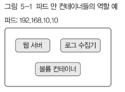

# 5. Pods

## 5.1 파드 개념

쿠버네티스는 실제로 파드라는 단위로 컨테이너를 묶어 관리하므로 보통 컨테이너 하나가 아닌 여러 개 컨테이너로 구성됨. 3장에서 살펴봤던 예제들도 단일 컨테이너를 관리하는 것 같지만 실제로는 컨테이너를 직접 관리하지 않고 파드 단위로 관리하는 것임. 물론 파드에 단일 컨테이너만 있을 때는 일반적인 방식으로 컨테이너를 관리해도 됨.
파드로 컨테이너 여러개를 한꺼번에 관리할 때는 컨테이너마다 역할을 부여할 수 있음. 파드 하나에 속한 컨테이너들은 모두 노드 하나 안에서 실행됨. 파드의 역할 중 하나가 컨테이너들이 같은 목적으로 자원을 공유하는 것이므로 가능한 일임.

파드 안에 여러개 컨테이너에 역할을 부여하는 예는 그림 5-1과 같음.



파드 안에 컨테이너 3개가 있고 역할을 부여했음. 그리고 파드 하나 안에 있는 컨테이너들이 IP 하나를 공유함. 즉, 외부에서 이 파드에 접근할 때는 그림의 192.168.10.10 이라는 IP로 접근하며 파드 안 컨테이너와 통신할 때는 컨테이너마다 다르게 설정한 포트를 사용함.

컨테이너 하나에 앞 그림의 세가지 역할을 모두 부여할 수도 있지만, 실제로 컨테이너 하나 안에 프로세스 2개 실행하도록 설정하는 것 자체도 간단치 않음. 시스템 신호나 종료 코드 처리도 프로세스마다 설정해줘야 하는 등의 번거로움이 뒤따름. 컨테이너의 관리 효율도 낮음.

## 5.2 파드 사용하기

코드 5-1 파드 설정 예(pod/pod-sample.yaml)
```yaml
apiVersion: v1
kind: Pod
metadata:
    name: kubenetes-simple-pod
    labels: 
        app: kubernetes-simple-pod
spec:
    containers:
    - name: kubenetes-simple-pod
      image: arisu1000/simple-container-app:latest
      ports:
      - containerPort: 8080
```

* .metadata.name 필드는 파드 이름을 설정함.
* .metadata.labels.app 필드는 오브젝트를 식별하는 레이블을 설정함. 여기에서는 해당 파드가 앱 컨테이너고 kubernetes-simple-pod라고 식별한다고 설정함.
* .spec.containers[].name 필드는 컨테이너의 이름을 설정함.
* .spec.containers[].image 필드는 컨테이너에서 사용할 이미지를 정함. 
* .spec.containers[].ports[].containerPort 필드는 해당 컨테이너에 접속할 포드 번호를 설정함. 여기에서는 8080으로 설정함.

## 5.3 파드 생명 주기

파드는 생성부터 삭제까지의 과정에 lifecycle 이 있음. 파드 생명주기는 다음과 같음.

* Pending: 쿠버네티스 시스템에 파드를 생성하는 중임. 이 상태는 컨테이너 이미지를 다운로드한 후 전체 컨테이너를 실행하는 도중이므로 파드 안의 전체 컨테이너가 실행될 때까지 시간이 걸림.
* Running: 파드 안 모든 컨테이너가 실행 중인 상태. 1개 이상의 컨테이너가 실행 중이거나 시작 또는 재시작 상태일 수 있음.
* Succeeded: 파드 안 모든 컨테이너가 정상 실행 종료된 상태로 재시작되지 않음.
* Failed: 파드 안 모든 컨테이너 중 정상적으로 실행 종료되지 않은 컨테이너가 있는 상태임. 컨테이너 종료 코드가 0이 아니면 비정상 종료이거나 시스템이 직접 컨테이너를 종료한 것임.
* Unknown: 파드의 상태를 확인할 수 없는 상태임. 보통 파드가 있는 노드와 통신할 수 없을 때임.

현재 파드 생명 주기는 `kubectl describe pods 파드이름` 명령을 실행한 후 Status 항목을 살펴보면 확인 할 수 있음.

```bash
$ k describe pods kubenetes-simple-pod
Name:         kubernetes-simple-app-69985bc76f-rtvk7
Namespace:    default
Priority:     0
Node:         docker-desktop/192.168.65.4
Start Time:   Tue, 21 Dec 2021 00:48:27 +0900
Labels:       app=kubernetes-simple-app
              pod-template-hash=69985bc76f
Annotations:  <none>
Status:       Running
IP:           10.1.0.52
IPs:
  IP:           10.1.0.52
Controlled By:  ReplicaSet/kubernetes-simple-app-69985bc76f
Containers:
  kubernetes-simple-app:
    Container ID:   docker://cfa956a491b8f9b7474585596d38740f6e44da8e8d216409d1f3456f53781229
    Image:          arisu1000/simple-container-app:latest
    Image ID:       docker-pullable://arisu1000/simple-container-app@sha256:18f5a0fb9d1faf26862eb7a301b5c2a8debe80f60e5db03ddeb16977d3c76011
    Port:           8080/TCP
    Host Port:      0/TCP
    State:          Running
      Started:      Tue, 21 Dec 2021 00:48:31 +0900
    Ready:          True
    Restart Count:  0
    Requests:
      cpu:        50m
    Environment:  <none>
    Mounts:
      /var/run/secrets/kubernetes.io/serviceaccount from kube-api-access-j4zsc (ro)
Conditions:
  Type              Status
  Initialized       True 
  Ready             True 
  ContainersReady   True 
  PodScheduled      True 
Volumes:
  kube-api-access-j4zsc:
    Type:                    Projected (a volume that contains injected data from multiple sources)
    TokenExpirationSeconds:  3607
    ConfigMapName:           kube-root-ca.crt
    ConfigMapOptional:       <nil>
    DownwardAPI:             true
QoS Class:                   Burstable
Node-Selectors:              <none>
Tolerations:                 node.kubernetes.io/not-ready:NoExecute op=Exists for 300s
                             node.kubernetes.io/unreachable:NoExecute op=Exists for 300s
Events:
  Type    Reason     Age    From               Message
  ----    ------     ----   ----               -------
  Normal  Scheduled  3m54s  default-scheduler  Successfully assigned default/kubernetes-simple-app-69985bc76f-rtvk7 to docker-desktop
  Normal  Pulling    3m54s  kubelet            Pulling image "arisu1000/simple-container-app:latest"
  Normal  Pulled     3m51s  kubelet            Successfully pulled image "arisu1000/simple-container-app:latest" in 2.6797282s
  Normal  Created    3m51s  kubelet            Created container kubernetes-simple-app
  Normal  Started    3m51s  kubelet            Started container kubernetes-simple-app
```

Status 항목을 보면 현재 파드가 Running 상태임. Conditions 항목은 파드의 현재 상태 정보를 나타내며 Type과 Status로 구분되어 있음.
Type에는 다음 같은 정보를 나타냄.

 * Initialized: 모든 초기화 컨테이너가 성공적으로 시작 완료 되었다는 뜻
 * Ready: 파드는 요청들을 실행할 수 있고 연결된 모든 서비스의 로드밸런싱 풀에 추가되어야 한다는 뜻.
 * ContainerReady: 파드 안 모든 컨테이너가 Ready 상태라는 뜻임
 * PodScehduled: 파드가 하나의 노드로 스케쥴을 완료했다는 뜻임.
 * Unschedulable: 스케쥴러가 자원의 부족이나 다른 제약등으로 지금 당장 파드를 스케쥴 할 수 없단 뜻임.

## 5.4 kubelet 으로 컨테이너 진단하기

컨테이너가 실행된 후에는 kubelet가 컨테이너를 주기적으로 진단함. 이떄 필요한 Probe 에는 다음 두 가지가 있음.

* livenessProbe: 컨테이너가 실행됐는지 확인함. 이 진단이 실패하면 kubelet은 컨테이너를 종료시키고, 재시작 정책에 따라서 컨테이너를 재시작함. 컨테이너에 liveness Probe를 어떻게 할 지 명시되지 않았다면 기본 상태 값은 Success 임.
* readinessProbe: 컨테이너가 실행된 후 실제로 서비스 요청에 응답할 수 있는지 진단함. 이 진단이 실패하면 엔드포인트 컨트롤러(Endpoint controller)는 해당 파드에 연결된 모든 서비스를 대상으로 엔드포인트 정보를 제거함. 첫 번째 readinessProbe를 하기 전까지의 기본 상태 값은 Failure 임. readinessProbe를 지원하지 않는 컨테이너라면 기본 상태 값은 Success 임.

앞 두가지 프로브가 있는 것이 쿠버네티스의 장점임. readinessProbe를 지원하는 컨테이너라면 컨테이너가 실행된 다음 바로 서비스에 투입되어서 트래픽을 받지 않음. 실제 트래픽을 받을 준비가 되었음을 확인한 후 트래픽을 받을 수 있음. 자바 애플리케이션처럼 프로세스가 시작된 후 앱이 초기화될 때까지 시간이 걸리는 상황에 유용함. 그 뿐만 아니라 앱을 실행할 때 대용량 데이터를 불러와야 하거나, 컨테이너 실행은 시작됐지만 앱의 환경 설정 실수로 앱이 실행되지 않는 항솽 등에 대비할 수 있음.
참고로 컨테이너 진단은 컨테이너가 구현한 handler를 kubelet이 호출해서 실행함. 핸들러에는 세 가지가 있음.
* ExecAction: 컨테이너 안에 지정된 명령을 실행하고 종료 코드가 0일때 Success 라고 진단함.
* TCPSocketAction: 컨테이너 안에 지정된 IP 와 포트로 TCP 상태를 확인하고 포트가 열려있으면 Success라고 진단함.
* HTTPGetAction: 컨테이너 안에 지정된 IP, 포트, 경로로 HTTP GET 요청을 보냄. 응답 상태 코드가 200~400 사이면 Success 라고 진단함.

진단 결과에도 세 가지가 있음
* Success: 컨테이너가 진단에 성공
* Failure: 컨테이너가 진단에 실패
* Unknown: 진단 자체가 실패해서 컨테이너 상태를 알 수 없음.

## 5.5 초기화 컨테이너

init container는 앱 컨테이너(app container)가 실행되기 전 파드를 초기화함. 보안상 이유로 앱 컨테이너 이미지와 같이 두면 안 되는 앱의 소스 코드를 별도로 관리할 때 유용함. 다음 특징이 있음.

* init container 는 여러 개 구성 가능. init container가 여러개 있다면 pod template에 명시한 순서대로 init container 가 실행됨.
* init container 실행이 실패하면 성공할 때까지 재시작함. 이런 init container 의 특성을 이용하면 쿠버네티스의 'declarative' 특징에서 벗어날 수 있음. 즉, 필요한 명령들을 순서대로 실행하는 데 사용하는 것임.
* init container 가 모두 실행된 후 app container 실행이 시작됨.

이러한 특징을 이용하면 pod를 실행할 때 app container 가 외부의 특정 조건을 만족할 때까지 기다렸다가 실행하도록 만들 수 있음. 예를 들어 init container 가 외부의 특정 조건을 만족할 때까지 대기하고 있다가 조건이 충족된 후 app container 를 싱행하는 것임.
init container 는 app container 와 비슷하게 동작하지만 몇 가지 다른 점이 있음. 그중 readinessProbe를 지원하지 않는다는 것을 꼭 기억해야함. pod 가 모두 준비되기 전에 실행한 후 종료되는 컨테이너기 때문임.

코드 5-2는 init container 설정한 파드 설정의 예임.

> 코드 5-2 init 컨테이너 설정 예
```yaml 
apiVersion: v1
kind: Pod
metadata:
  name: kubernetes-simple-pod
  labels:
    app: kubernetes-simple-pod
spec:
  initContainers:
  - name: init-myservice
    image: arisu1000/simple-container-app:latest
    command: ['sh', '-c', 'sleep 2; echo helloworld01;']
  - name: init-mydb
    image: arisu1000/simple-container-app:latest
    command: ['sh', '-c', 'sleep 2; echo helloworld02;']
  containers:
  - name: kubernetes-simple-pod
    image: arisu1000/simple-container-app:latest
    command: ['sh', '-c', 'echo The app is running! && sleep 3600']
```